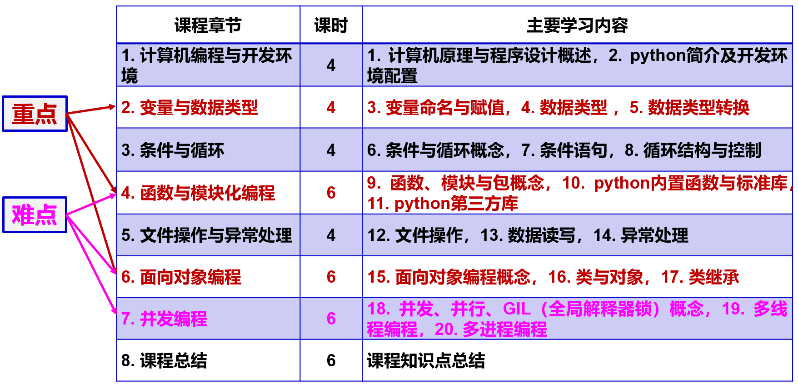

# 编程基础  
## 主要内容及重难点

## **!!! 作业及截止日期**  
- ~~选做作业1：地学编程Python开发环境配置~~         
**~~截止日期：2025.11.20~~**

- **选做作业2**：选课同学同学地理信息统计分析               
**截止日期：2025.12.20**    

- **选做作业3**：基于地图的地理数据统计分析编程       
**截止日期：2026.1.10**    

